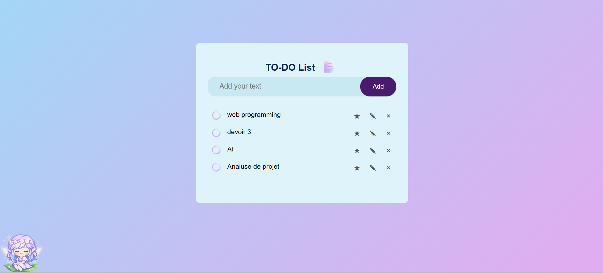
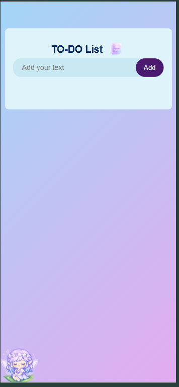
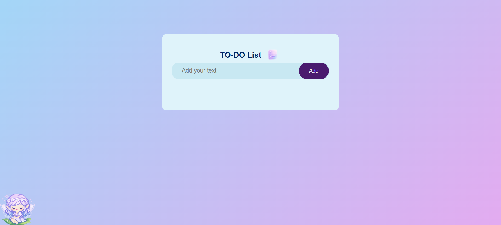
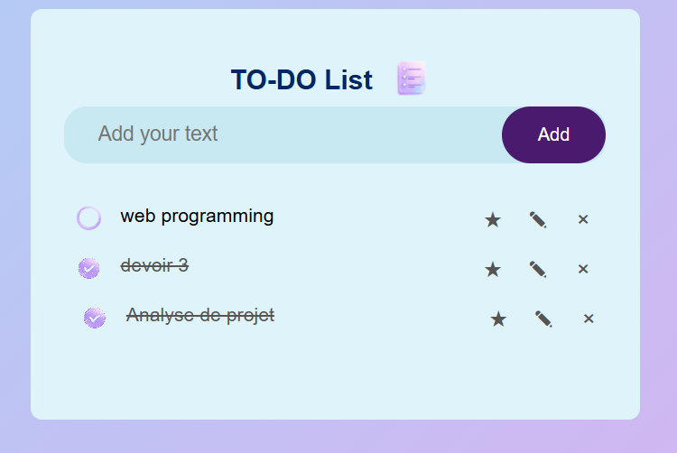
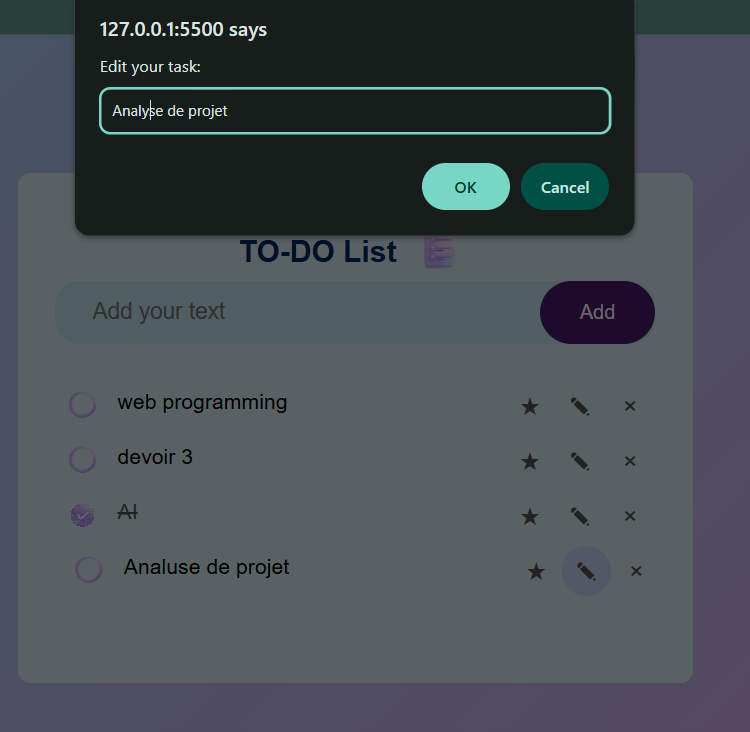
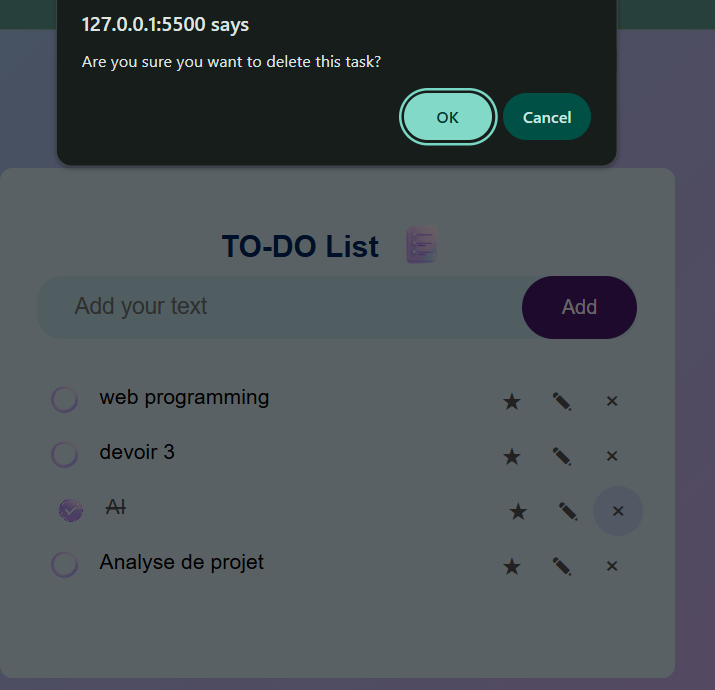
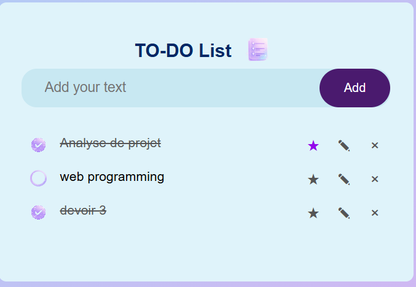
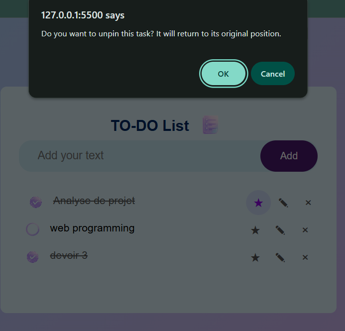

# To-Do List App

A responsive to-do list built with HTML, CSS, and JavaScript. Tasks are saved in the browser's local storage.

## Features

- Add, edit, complete, and delete tasks
- Pin tasks to the top then restore their original position when unpinned from the page
- Confirmation for deleting and unpinning
- Responsive mobile layout
-edit section
- Clickable character at the bottom that move across the screen

## Run

Open `index.html` in a web browser. Tasks are saved separately by browser and page origin, so use the same browser and opening method to see the same saved list.

## Screenshots

### Desktop

### Mobile

### Empty list

### Completed tasks

### Edit task dialog

### Delete confirmation

### Pinned tasks

### Unpin confirmation

